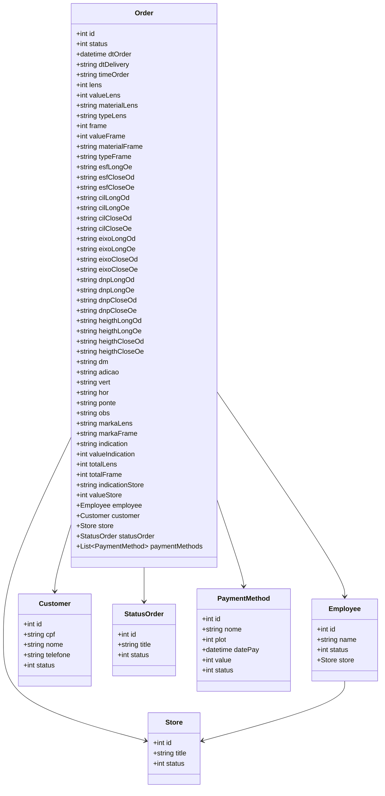

# Final Optics Challenge - DIO - GFT - Java Development with AI

https://optics.up.railway.app/swagger-ui/index.html#/

RESTful API otica 2023 built in Java 17 with Spring Boot 3.

## Main Technologies
- **Java 17**: We will use the latest LTS version of Java to take advantage of the latest innovations that this robust and widely used language offers;
- **Spring Boot 3**: We will work with the newest version of Spring Boot, which maximizes developer productivity through its powerful auto-configuration premise;
- **Spring Data JPA**: We will explore how this tool can simplify our data access layer, facilitating integration with SQL databases;
- **OpenAPI (Swagger)**: We will create effective and easy-to-understand API documentation using OpenAPI (Swagger), perfectly aligned with the high productivity that Spring Boot offers;
- **Railway**: facilitates the deployment and monitoring of our solutions in the cloud, in addition to offering several databases as a service and CI/CD pipelines.

